# 챗봇Q-영어단어봇 제작 및 활용

요즘 기계와 상호작용하는 방식 중에 하나인 대화형 인터페이스가 부각되면서 챗봇의 활용 가능성이 높아지고 있습니다. 그러면 그런 챗봇을 어떻게 만들까요? 이 질문에 대한 답변이 영어교육을 전공하는 분들게 도움이 되기를 바랍니다.

## 1부. 챗봇의 기획

챗봇(chatbot)은 말하는 로봇(chatting robot)의 줄인 말로 언어를 통해 상호작용하는 사람들의 속성을 반영하여 만들어진 소프트웨어입니다. 촘스키(Chomsky)의 언어학에서부터 시작된 자연어 처리(natural language processing) 지식이 발전하고 기계학습(machine learning) 알고리즘이 계속 연구되어 오다가 하드웨어와 네트워크가 발전하면서 상상할 수 없는 대규모의 언어 데이터가 쌓이다보니 대화를 나눌 만한 챗봇을 만드는 것이 가능해졌습니다. 또한 검색 기술의 정교함도 챗봇 개발에 한몫을 하지 않았을까 싶습니다. 왜냐하면 사람의 말에 챗봇이 응답한다는 것이, 관점을 달리해서 생각해보면, 사람의 검색 요청에 한 개의 검색 결과를 보여주는 것이라고 볼 수도 있으니까요. 챗봇이라는 것이 한 개의 검색 결과로 승부(?)하는 일종의 기술의 자신감이라고 볼 수 있을지 모르겠네요.

우리의 대화는 보통 말을 서로 한 번씩 주고받음으로써 이루어집니다. 예를 들어 다음과 같은 경우이지요.

A: 화장실이 어디인가요?
B: 엘리베이터 건너편에 있습니다.

한번 위 대화를 마음속으로 해보세요. 혼자 하더라도 마치 남과 대화하는 것처럼 말하게 됩니다. 대화가 우리 사람들의 속성이라는 것을 느낄 수 있을 겁니다. 우리의 대화가 이와 같이 하나의 대화쌍으로 끝나는 경우도 있지만, 여러 대화쌍으로 대화가 이루어지는 경우도 많습니다. 오늘이나 어제 누군가와 대화를 나누셨던 기억을 떠올리면 쉽게 짐작하실 수 있을 겁니다. 또는 대화쌍의 구체적인 모습으로 연극 대본이나 영화 시나리오를 생각해봐도 됩니다.
챗봇이 대화 상대방이 된다면 대화쌍 중 한 부분을 챗봇이 담당하게 됩니다. 예를 들어, 건물 복도를 어슬렁거리는 바퀴가 달린 로봇이 있어서 로봇에게 ‘화장실이 어디인가요?’라고 물을 때 로봇이 ‘엘리베이터 건너편에 있습니다.’라고 답을 할 수 있겠지요. 이처럼 챗봇은 스마트폰에도 있고, 스마트스피커에도 있을 수 있지만, 로봇에 내장될 수도 있습니다. 즉, 챗봇은 대화형 인터페이스를 활용하는 소프트웨어라는 얘기지요.
현재의 기술 수준에서 챗봇이 모든 주제에 대해 대화를 나누기에는 한계가 뚜렷합니다. 스마트폰에서 챗봇을 사용하실 수 있다면 챗봇과 대화를 한번 나눠보세요. 대화를 좀 하다보면, 챗봇이 ‘무슨 말인지 이해하지 못했습니다.’와 같은 응답을 하는 경우가 많을 겁니다. 아니면 ‘아무말 대잔치’를 할지도 모르고요. 하지만 챗봇은 특정 정보를 제공하는 측면에서는 능력을 발휘할 수도 있습니다. 언어의 기능을 정보 교환 기능과 사교 기능으로 나눠본다고 할 때 현재의 챗봇은 사교적인 대화 기능은 약하지만 특정 분야의 정보 제공 기능은 어느 정도 수행할 수 있습니다. 이상과 같은 챗봇의 기능과 현재의 한계를 생각해볼 때, 지금 수준에서 IT 전문가가 아닌 일반인들이 성공적인 챗봇을 만들려면 정보 제공을 주된 목적으로 하는 챗봇을 만드는 것이 좋습니다. 

챗봇 제작을 교육과정과 교재를 개발하는 관점에서 생각한다면, 정보 제공 측면에서 챗봇의 목적을 설정하고 대화형 교재나 콘텐츠로서 챗봇을 만든다고 생각해볼 수 있습니다. 영어교육 전문가로서 정보 제공을 목적으로 챗봇을 만든다고 할 때 무슨 챗봇을 만들어보면 좋을까요? IT 전문가가 아닌 일반인 수준에서 챗봇을 처음 만든다면 무언가(자기 자신, 모임, 기관 등)를 소개하는 챗봇을 만들어보면 좋을 것입니다. 또는 간단한 언어 자료를 이용하여 정형화된 방식으로 진행되는 영어 학습 챗봇을 만들어볼 수 있을 것입니다. 그래서 본 글에서는, 하나의 사례로, 객관식 문제를 이용한 영어 단어 학습 챗봇을 제작해보고자 합니다. 이 챗봇을 ‘영어단어봇’이라고 이름 지어 보겠습니다.

예시로 만들 영어단어봇의 대략적인 기획은 다음과 같습니다.

1. 대상자: 중학생
2. 학습 목표: 10개의 영어 어휘 학습
3. 대상 단어: treatment, drown, rope, breathe, lay, come around, hold on to, insect, try to, upward (출처: 천재 중3 영어교과서, Lesson 9, The ABCs of First Aid) 
4. 데이터: 10개 단어를 이용한 객관식 문제와 관련 자료
5. 챗봇 활용: 영어 수업을 마친 후 학생들이 개별적으로 챗봇과 영어 단어를 학습함 

영어단어봇을 처음 만들 때는 시간이 꽤 걸릴 겁니다. 하지만, 학생들에게 단어 공부를 그냥 맡겨두는 것이 아니라 학습 도구를 제공해주면서 단어 공부를 하라고 하면 학생들이 단어를 공부할 가능성이 커지지 않을까요? 그리고 이렇게 만든 챗봇이 유용하면 나중에는 학습할 단어만 바꾸면 되기 때문에 챗봇을 만드는데 걸리는 시간도 크게 줄어들 것입니다. 혼자가 아니라 여러 분들이 함께 영어단어봇을 만든다면 시간도 줄이면서 협업의 성과도 얻을 수 있기 때문에 괜찮을 것 같네요. 
‘단어 학습에 무슨 챗봇이 필요해?’라고 반문하실 수도 있습니다. ‘그냥 있는 자료로 활용해서 외우게 시키면 되지, 구태여 없는 시간 들여 챗봇을 만들 필요가 있을까?’라고 생각하실 수 있으실 겁니다. 이런 반문과 생각이 잘못된 것은 아닙니다. 자연스러운 것입니다. 챗봇 활용 학습은 충분히 검증되지 않은 새로운 방식이니까요. 다만, 이번 기회에 챗봇을 이용한 학습이라는 새로운 시도를 해보는 것은 어떨지요? 그 시도가 성과와 발전의 계기가 된다면 좋을 일입니다. 나중에 챗봇을 이용한 영어교육 연구와 개발, 그리고 사용이 일반화될 수도 있습니다. 그러니 첫 번째 펭귄처럼 지금 한 번 해보는 것도 괜찮을 것 같습니다.

이번의 챗봇 제작 프로젝트의 경우, 영어 단어 10개를 명시적으로 학습하는 경우이니 학습 요소를 명시적으로 나눈 구조주의적 접근법에 따라 교수설계를 하면 될 것 같습니다. 그리고 평가의 환류효과(washback effect)를 고려하여 객관식 문제를 푸는 방식으로 단어 학습을 하도록 챗봇을 설계하는 것이니 학생들은 챗봇과의 상호작용 방식이 익숙할 것입니다. 학생들은 편리할 때 스마트폰이나 컴퓨터에서 받은 챗봇 링크를 클릭하면 됩니다. 그러면 챗봇은 학생과 정해진 대화를 하면서 학생들에게 객관식 단어 문제를 제시하게 됩니다. 학생들은 문제를 풀게 되고, 챗봇은 학생들이 문제를 맞게 풀었는지 아닌지 알려주게 됩니다. 문제를 맞췄으면 다음 문제로 넘어가고, 틀렸으면 같은 문제를 다시 풀게 됩니다. 10문제가 동일한 과정으로 제시된 후 학습을 마치게 됩니다. 좀 더 공부하고 싶은 학생들은 챗봇과 함께 다시 문제를 풀면 됩니다. 이 과정을 순서도로 나타내면 다음과 같습니다.

만들고자 하는 영어단어봇이 처음 만드는 챗봇이기 때문에 기능을 간단하게 하였습니다. 챗봇 제작이 익숙해지거나 추가하고자 하는 기능이 생기면 좀 더 복잡한 챗봇을 만들 수 있을 것입니다. 또한 학생들이 입력하는 값(보기 선택, 문항 맞춤 여부 등)을 데이터베이스에 저장하여 학습 분석에 활용할 수도 있습니다.

챗봇을 제작하기 위해서는 제작 툴이 필요합니다. 제작 툴로써 전문적이고 어려운 수준에서는 Python과 같은 언어로 프로그래밍할 수 있는 에디터, 챗봇이 사용할 데이터가 저장되어 있는 데이터베이스, 그리고 온라인에서 챗봇을 사용할 수 있게 해주는 웹서버 등이 필요합니다. 하지만, IT 전문가가 아닌 일반인들이 챗봇을 제작하는 경우에는 보다 쉬운 방법이 필요합니다. 마치 워드프로세서나 WYSIWYG 방식의 웹페이지 제작 툴로, HTML 코드를 모르더라도, 웹페이지를 만드는 것처럼요. 챗봇 제작에서 쉬운 제작 방식이 바로 챗봇 빌더(builder)를 이용하는 것입니다.

## 2부. 챗봇 제작 환경 구축

이번 부분에서는 ‘챗봇 제작 환경 구축’ 방법으로 챗봇 빌더에 대해 알아보고자 합니다. 짐작하실까 모르겠는데요, 현재 다양한 챗봇 빌더들이 치열한 경쟁을 벌이고 있습니다. 왜냐하면 챗봇이라는 새로운 시장이 이제 막 열리고 있다고 생각하는 사람들이 많거든요.

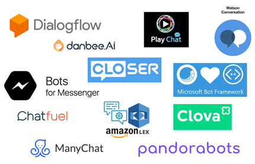

그러면 다양한 빌더들 중에서 적당한 것을 고르기 위해 고려해야 할 사항으로 무엇이 있을까요? 제 나름대로 생각해본 항목을 적어보면 다음과 같습니다. 챗봇 빌더 선택시 고려사항은 다음 책의 내용을 바탕으로 하였습니다. (김영우. (2019). AI 챗봇 빌더와 간단한 챗봇 제작. 김혜영 외, 영어학습을 위한 인공지능 챗봇 활용 및 제작 (pp. 117-143). 파주: 교육과학사.)

* WYSIWYG 방식: 웹페이지를 만드셨던 경험이 있으신가요? 웹페이지를 만들 때 HTML 코드를 사용하셨나요? 만약 HTML 코드를 사용하지 않고 웹페이지를 만드셨다면 WYSIWYG 방식을 사용하셨을 겁니다. WYSIWYG라는 용어는 ‘What You See Is What You Get’의 각 단어의 첫 글자를 딴 두문자어(acronym)로 WYSIWYG 방식은 컴퓨터 언어를 직접 사용하지 않고 컴퓨터가 실행할 수 있는 결과물을 만드는 방식을 말합니다. 챗봇도 일종의 소프트웨어인데, 챗봇 빌더로 챗봇을 만들 때 Python과 같은 컴퓨터 언어로 코딩하지 않고 챗봇을 만든다면 WYSIWYG 방식으로 챗봇을 만든다고 볼 수 있습니다.
* 무료 빌더: 챗봇에 대해 잘 모르는 경우에 처음부터 비용을 지불해야 하는 유료 챗봇 빌더는 부담스러울 수 있습니다. 영어단어봇처럼 기본적인 기능의 챗봇을 제작하는 데는 무료 챗봇 빌더면 충분하다고 생각합니다. 다만, 챗봇 사용량이 많아지거나 챗봇에 고급 기능을 추가하는 경우 어떻게 될지 미리 알아볼 필요는 있습니다. 혹시라도 나중에 만드신 챗봇이 많이 쓰이는 경우를 대비해서 말이죠.
* 대화 구현 용이성: 챗봇은 대화를 주고받는 인터페이스인 만큼 챗봇 빌더를 이용하여 챗봇을 제작할 때 사람과 챗봇 사이에 예상되는 대화를 쉽게 구현할 수 있어야 합니다. 영어단어봇의 경우 챗봇이 대화를 통해 학생으로 하여금 객관식 문제를 풀면서 영어 단어를 학습할 수 있게 해주어야 합니다. 이 대목에서 챗봇에 대해 사람들이 갖고 있는 막연한 기대를 다시 한 번 명확히 할 필요가 있습니다. 챗봇이라는 것이 신비한 능력을 발휘하여 사람의 말에 응답하는 것이 아닙니다. 데이터와 알고리즘에 기반해서 답을 하는 것입니다. 아니면 주어진 대화 시나리오에 따라 답을 하는 것입니다. 또는 요즘 많이 쓰이는 방식은 앞의 두 방식을 결합한 방식으로 대화 시나리오를 기반으로 하되 데이터/알고리즘을 적절하게 활용하여 답을 하는 방식입니다. 영어단어봇의 경우는 대화 시나리오에 따라 답을 하는 방식으로 만들게 됩니다. 데이터와 알고리즘을 활용하는 방식은 별로 쓰지 않을 것입니다. 이유는, 현재의 기술 수준에서, 10개의 단어 학습이라는 명확한 목표 달성을 위해서는 대화 시나리오 방식이 효율적이라고 생각하기 때문입니다. 하지만 향후에 챗봇의 활용도를 높이려면 데이터/알고리즘 활용 방식에 계속 관심을 둘 필요는 있습니다.
* 리치 인터액션(rich interaction): 챗봇이 말로 대화를 제대로 할 수 없는 경우에 말 대신 버튼, 이미지, 이모티콘 등으로 사람과 상호작용을 할 수 있는데, 이를 리치 인터액션이라고 말합니다. 여기에서 리치(rich)라는 긍정적인 용어를 쓰고 있지만 챗봇의 부족한 대화 능력을 적절히 감추고자 할 때 리치 인터액션을 사용한다고 보면 됩니다. 이 글을 통해 만들 객관식 문제 풀이봇인 영어단어봇의 경우 리치 인터액션 개념을 응용하여 객관식 문제의 각 보기를 버튼으로 제공할 예정입니다.

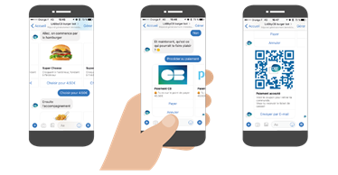

* 음성/문자 변환: 사람들이 챗봇과 대화할 때 글자만 쓰거나 말만 하는 것이 아니라 둘 다(텍스트 채팅과 보이스 채팅)를 함께 할 수 있으면 좋습니다. 관련하여 음성 문자 변환(Speech to Text, STT)과 문자 음성 변환(Text to Speech, TTS) 기능이 필요합니다. 현재는 텍스트 챗봇이 많은 상황이고, 영어단어봇도 텍스트 챗봇의 형태로 만들 것입니다. 하지만, 음성 챗봇의 가능성은 계속 커지고 있으니 지속적인 관심을 가질 필요가 있습니다. 그러므로 챗봇이 사용할 문장을 준비할 때 해당 문장이 텍스트로 제시되는 경우와 음성으로 제시되는 경우를 함께 생각해보는 것이 좋습니다.
* 플랫폼 지원: 챗봇 빌더로 챗봇을 완성했다고 했을 때 이렇게 만든 챗봇을 어떻게 사용할 수 있을까요? 챗봇이 소프트웨어라고 하는데, 이 소프트웨어를 어떻게 실행할 수 있을까요? 이 대목에서 챗봇이 등장하게 된 배경을 생각해볼 필요가 있습니다. 최근에 사람들이 컴퓨터 대신에 스마트폰을 많이 쓰게 되었습니다. 그리고 최근 몇 년 사이에 사람들이 메시지앱(카카오톡, 페이스북 메신저, 텔레그램 등)을 아주 많이 쓰고 있습니다. 챗봇이 목표로 하는 가장 이상적인 상황은 사람들이 메시지앱에서 다른 사람들과 대화를 하듯이 챗봇과 대화하는 상황입니다. 그러므로 메시지앱에서 챗봇을 부르는 순간 챗봇이라는 소프트웨어가 실행되어 작동하는 것입니다. 다음으로, 챗봇을 만드는 입장에서는 만든 챗봇이 하나의 메시지앱이 아니라 여러 메시지앱에서 쓰일 수 있기를 바랄 것입니다. 이런 메시지앱을 플랫폼이라고 부를 수 있으므로 챗봇 빌더가 여러 플랫폼을 지원한다는 말의 의미는 챗봇 빌더로 만든 챗봇을 여러 플랫폼에서 사용할 수 있다는 말이 되는 것입니다. 이 대목에서 챗봇 관련 최근 상황을 말씀드리면 우리나라의 ‘국민SNS’라고 할 수 있는 카카오톡에서 챗봇 빌더로 만든 챗봇을 사용하는 것이 쉽지 않습니다. 그러다보니 우리나라 사람들이 챗봇에 아직 익숙하지 않은 것 같습니다. 반면, 페이스북 메신저나 텔레그램에서는 챗봇을 쉽게 사용할 수 있고요. 참고로 챗봇은 웹사이트 등에도 제공될 수 있습니다. 그래서 그런지 요즘 웹사이트를 다니다보면 화면 어딘가에 챗봇(또는 챗봇 형태의 캐릭터)이 대화하기를 기다리는 모양을 많이 보게 됩니다. 영어단어봇의 경우 메시지앱 내부에서 작동하는 방식이 아니라 메시지앱 모양의 화면에서 작동되는 방식으로 제공될 예정입니다. 이와 같은 기본 제공 방식 외에 여건이 되면 가능한 플랫폼에 탑재해서 사용해볼 수도 있습니다.

이제까지 말씀드린 고려사항을 참고하면서 챗봇 빌더를 알아보고 선택하면 좋지 않을까 싶습니다. 이 글은 챗봇 빌더를 비교하기보다는 챗봇을 실제로 만들어 보는 것을 목적으로 하는 만큼 몇 개의 챗봇 빌더를 간단하게 소개하고자 합니다. 가장 많이 알려진 챗봇 빌더는 아마도 구글의 Dialogflow(https://dialogflow.com/)가 아닐까 싶습니다. 이 챗봇 빌더의 원래 이름은 API.AI였는데 구글이 인수하면서 이름이 Dialogflow가 되었습니다. 구글 계정이 있으면 Dialogflow를 무료로 사용할 수 있습니다. Dialogflow의 경우 샘플도 많고, 인터넷에 검색해보면 참고할만한 자료도 많아 영어 전용 챗봇을 만들 경우 유용합니다. 다음으로 Chatfuel(https://chatfuel.com/)이 있습니다. Chatfuel을 이용해서 만든 챗봇은 주로 페이스북에서 사용할 수 있는 만큼 페이스북 활동을 많이 하는 사람들이 페이스북 페이지에서 활용하기 좋은 챗봇 빌더입니다. 플러그인이 많다는 점도 Chatfuel의 장점으로 꼽힙니다. Chatfuel과 비슷한 챗봇 빌더로 ManyChat(https://manychat.com/)도 있습니다. 그리고 판도라봇(Pandorabots)(https://www.pandorabots.com/)이라는 챗봇 빌더도 있는데, AIML(Artificial Intelligence Markup Language)이라는 언어로 만들어졌다는 특징을 갖고 있습니다. AIML은, 웹페이지를 만드는 HTML처럼, XML 언어를 챗봇 개발에 최적화시킨 언어로 HTML에 익숙하다면 시도해볼 수 있을 것입니다. 다음으로 국내 챗봇 빌더 중에 단비(https://danbee.ai/)가 있습니다. 단비는 LG CNS의 사내 벤처에서 출발하여 2017년에 사업을 본격적으로 시작한 회사로 한국어를 사용하는 챗봇을 제작하는데 최적화되어 있다고 볼 수 있습니다. 그 외 다른 챗봇 빌더가 많은데 챗봇 빌더에 대한 소개는 다른 기회에 하도록 하겠습니다. 
 
이 글에서는 앞에 소개한 챗봇 빌더 중에서 단비를 이용해서 챗봇 제작 환경을 구축하려고 합니다. 챗봇 빌더로 단비를 선택한 이유는 크게 세 가지로, 첫째는 단비의 대화흐름 방식이 대화 시나리오를 만들기 편리하기 때문입니다. 둘째는 단비가 한국 업체라서 챗봇을 만들면서 생기는 궁금증에 대해 상대적으로 쉽게 답변과 해결책을 얻을 수 있기 때문입니다. 단비 웹사이트 주소는 https://danbee.ai/입니다. 인공지능 관련 웹사이트의 도메인의 끝자리가 ai로 끝나는 경우가 많은데 단비 사이트도 같습니다. 단비 초기 화면에서 ‘danbee.AI 무료로 시작’을 누르면 회원 가입 화면으로 이동하게 되고, ‘오늘도 챗봇 키우기’ 또는 ‘danbee.AI 시작’을 누르면 로그인 화면으로 이동하게 됩니다. 단비 계정을 만드는 방법은 크게 두 가지로, 이메일을 ID로 하여 계정을 만드는 방식과 네이버 계정 등 잘 알려진 외부 계정을 이용해서 계정을 만드는 방식이 있습니다. 제 경우 처음에는 이메일을 ID로 하여 계정을 만들었다가 로그인할 때마다 보안을 위해 이메일로 받은 인증키를 입력해야 하는 불편함이 있어서 네이버 계정으로 또 다른 단비 계정을 만들어 사용하고 있습니다. 단비는 브라우저로 구글의 크롬을 추천하고 있으니 챗봇을 만들기 위해 단비 사이트에 접속할 때 구글 크롬을 이용하시기 바랍니다. 그리고 스마트폰으로 단비에 로그인할 수는 있으나 챗봇을 만들기 위해서는 컴퓨터나 노트북에서 단비 사이트에 로그인해야 합니다. 

이제까지 말씀드린 내용을 바탕으로 챗봇 제작을 위한 환경 설정 사항을 정리하면 다음과 같습니다.

* 컴퓨터나 노트북
* 인터넷 연결
* 구글 크롬 (https://www.google.com/intl/ko/chrome/)
* 단비 (https://danbee.ai/) 계정

## 3부. 챗봇 제작

영어교육 분야에서 가끔 영어 지식(English usage)과 영어 사용(English use)을 비교하면서 선언적 지식(declarative knowledge)과 절차적 지식(procedural knowledge)에 대한 얘기를 합니다. 물론 이런 얘기를 통해 영어 사용의 중요성을 강조하는 경우가 많지요. 그러면서 관련 사례로 운전에 대한 지식이 많아도 운전하는 것이 더 중요하다는 얘기를 합니다. 이런 비교를 챗봇 개발에 적용해본다면 챗봇에 대해 아는 것보다 챗봇을 실제로 만들어보는 것이 더 중요하다고 얘기할 수 있겠지요. 이번 3부는 챗봇 개발의 절차적 지식을 익히는 과정입니다. 이해를 돕기 위해, 또 다른 절차적 지식으로 많이 언급되는, 음식 만드는 과정을 머릿속으로 상상해보시면서 다음 표를 보시겠습니다. 

음식을 만드는 순서와 챗봇을 개발하는 순서 비교

음식
1. 초대할 손님을 위해 만들 음식을 정한다.
2. 음식을 할 수 있는 곳(주방)으로 간다.
3. (필요한 경우) 잠긴 문을 연다.
4. 음식 만드는데 필요한 재료를 모은다. (어떤 재료는 미리 준비해두어야 한다.)
5. 음식을 만든다.
6. 가까운 사람에게 음식 맛보기를 부탁한다.
7. 손님에게 음식을 낸다. (식탁 또는 지정된 장소)
8. 음식에 대한 손님의 피드백에 귀 기울인다.
9. 다음에 같은 음식을 할 경우를 위해 개선점을 생각해둔다.

챗봇
1. 목표 사용자를 위해 만들 챗봇(우리는 영어단어봇)을 정한다.
2. 챗봇을 만들 수 있는 곳(챗봇빌더 사이트, 단비)으로 간다.
3. 챗봇빌더 사이트에 로그인한다.
4. 챗봇 제작에 필요한 요소를 파악한다. (어떤 요소는 미리 준비해두어야 한다. 우리의 경우 단어 문제 자료)
5. 챗봇을 제작한다.
6. 아는 사람에게 챗봇 테스트를 부탁한다.
7. 목표 사용자에게 챗봇을 알린다. (챗봇 링크 전달, 플랫폼에 탑재)
8. 챗봇에 대한 사용자의 피드백에 귀 기울인다.
9. 다음에 챗봇을 업데이트할 경우를 위해 개선점을 생각해둔다.

어떤가요? 비교가 그럴 듯한가요? 그렇다면 다행입니다. 익숙한 경험을 기준으로 새로운 경험을 익힐 수 있으면 좋으니까요. 참고로 음식을 직접 만들지 않고 이미 만들어진 음식을 사거나 특별하게 원하는 음식이 있는 경우 요리사에게 주문할 수 있는 것처럼, 챗봇의 경우도 이미 만들어진 챗봇을 구입할 수 있고(이런 챗봇 시장이 아직은 없습니다만 혹시 나중에 생길지 모르죠), 원하는 기능을 갖춘 챗봇을 제작 요청할 수도 있습니다. 이 경우 시간과 노력은 적게 들겠지만 비용은 더 들겠지요. (아, 물론 음식 재료를 사는 것이 만든 음식을 사는 것보다 돈이 더 드는 경우가 있습니다만, 원론적으로 그렇다는 말입니다.^^) 반면, 음식 준비를 텃밭부터 시작할 수도 있는 것처럼 Python과 같은 프로그래밍 언어를 배워 챗봇을 제작할 수도 있습니다. 구태여 이런 방식을 선호하신다면 시도해보셔도 좋지만, 시간과 노력이 많이 들어가 ‘배보다 배꼽이 더 커지는’ 상황이 발생할 수도 있으니 감안하시기 바랍니다. (하지만 저는 이런 방식도 좋아하기 때문에 우여곡절을 거치면서 시도해보고 있습니다.) 이제부터 앞의 표에 나온 내용을 편의에 따라 묶어 설명하겠습니다.

1) 목표 사용자를 위해 만들 챗봇(우리는 영어단어봇)을 정한다.

이 부분은 앞에서 이미 정한 것이니 달리 설명할 것은 없겠습니다. 다만, 영어 단어 학습이 영어 교과서 본문에 나오는 단어를 학습한다는 맥락을 가정한다는 점만 다시 한 번 확인하도록 하겠습니다. 즉, 영어 단어만 별도로 공부하는 것이 아니라 교과서 본문 이해를 위해 단어를 공부하는 것입니다. 그래서 단어의 예문을 교과서 본문에서 가져왔습니다. 

2) 챗봇을 만들 수 있는 곳(챗봇빌더 사이트, 단비)으로 간다.
3) 챗봇빌더 사이트에 로그인한다.

단비 웹사이트 주소는 https://danbee.ai/입니다. 단비 초기 화면에서 ‘danbee.AI 무료로 시작’을 누르면 회원 가입 화면으로 이동하게 되고, ‘오늘도 챗봇 키우기’ 또는 ‘danbee.AI 시작’을 누르면 로그인 화면으로 이동하게 됩니다. 

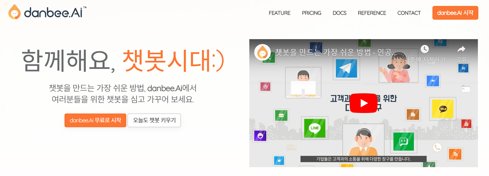

단비 계정을 만드는 방법은 크게 두 가지로, 이메일을 ID로 하여 계정을 만드는 방식과 네이버 계정 등 잘 알려진 외부 계정을 이용해서 계정을 만드는 방식이 있습니다. 외부 계정으로 단비 계정을 만드는 것이 편리합니다.

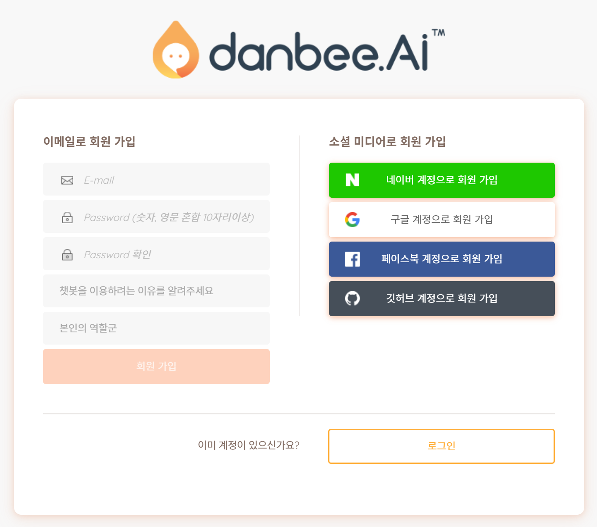

단비는 브라우저로 구글의 크롬을 추천하고 있으니 챗봇을 만들기 위해 단비 사이트에 접속할 때 크롬을 이용하시기 바랍니다. 그리고 앞에서 말씀드린 사항입니다만, 단비에서 챗봇을 만들기 위해서는 인터넷이 연결된 노트북이나 컴퓨터에서 단비 사이트에 로그인하셔야 합니다. 단비 챗봇빌더가 인터넷 연결이 필요한 클라우드 서비스이기 때문입니다. 다른 챗봇빌더들도 비슷합니다.

4) 챗봇 제작에 필요한 요소를 파악한다.

챗봇빌더인 단비 사이트에서 챗봇 제작에 필요한 요소를 파악하기 위해서는 단비 사이트에 어떤 메뉴가 있는지 알아야 합니다. 그러고 단비로 만든 샘플 챗봇들이 어떤 것이 있는지 살펴보는 것도 좋습니다. 이를 위해 단비 사이트에 로그인한 후 처음으로 나타나는 챗봇목록 화면을 살펴보겠습니다.

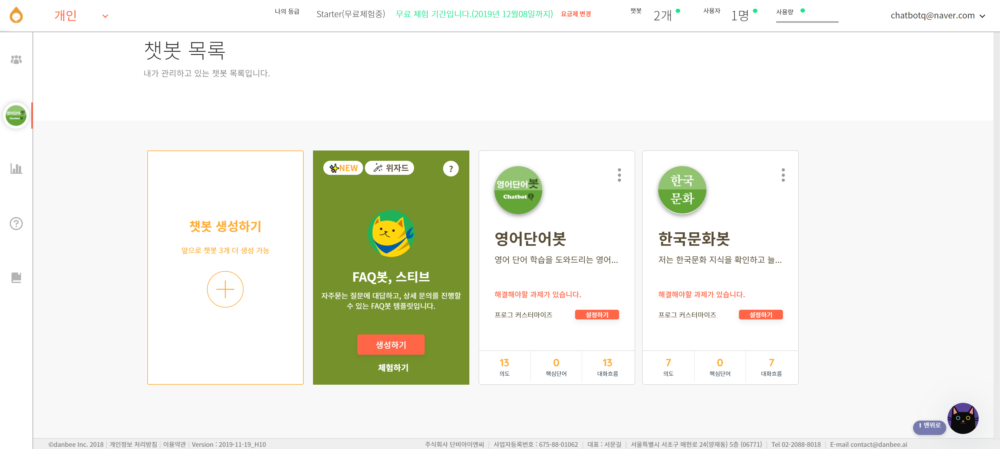

단비 사이트에 로그인을 하게 되면 앞과 같은 챗봇목록 화면이 뜹니다. 화면에는 ‘챗봇 생성하기’ 카드와 ‘FAQ봇 스티브’와 같은 샘플 챗봇 생성 카드가 나올 겁니다. (참고로, 위 화면은 제가 ‘한국문화봇’이라는 챗봇을 이미 만든 상태에서 화면을 캡처한 것이라 추가적인 챗봇이 함께 보입니다.) 화면의 왼쪽의 여러 메뉴는 챗봇을 생성하신 후에 사용하실 수 있습니다. 왜냐하면 그 메뉴들의 내용이 챗봇에 따라 달라지기 때문입니다.
당연한 얘기지만, 영어단어봇을 만들기 위해서 영어 단어 문제와 관련 자료를 준비해야 합니다. 각 단어 문제의 자료는, 문제 지시문, 문제 보기 4개, 각 보기에 따른 힌트 4개, 문제 설명 및 추가 자료입니다. 챗봇에서 각 단어의 발음을 들려주기 위해서는 발음 파일을 인터넷 어딘가에 저장해두고 챗봇에 불러올 수 있어야 하고, 챗봇 제작시 HTML 코딩을 좀 해야 합니다. 이번 글에서는 발음 부분은 포함하지 않습니다.

5) 챗봇을 제작한다.

5번 단계인 챗봇 제작이 이 글의 핵심 부분입니다.

5-1) 챗봇의 초기 설정

앞의 챗봇목록 화면에서 ‘챗봇 생성하기’ 카드를 클릭하시면 ‘빈 챗봇 생성하기’ 카드가 나오는 화면으로 넘어갑니다. 여기에서 ‘생성하기’를 클릭하세요. 그러면 그 다음 화면에서 챗봇 생성을 위한 정보 (챗봇 썸네일, 챗봇 이름, 챗봇 카테고리, 챗봇 설명) 입력 화면이 나옵니다.
챗봇 썸네일은 작은 챗봇 이미지인데, 나중에 추가하셔도 됩니다. 챗봇이름은 ‘영어단어봇’, 챗봇 카테고리는 ‘교육’, 챗봇 설명은 적당히. 모든 항목을 나중에 수정할 수 있습니다. 정보 입력을 마친 후 화면 하단의 ‘저장’ 버튼을 누르시면 챗봇이 생성됩니다.
생성한 챗봇이 제대로 작동하는지 살펴보기 위해, 화면 좌측 메뉴에서 방금 만든 챗봇이 선택되었는지 확인한 후 화면 우측 상단에 있는 작은 말풍선 버튼을 눌러보세요. 그러면 화면 우측에 대화창 화면이 생기면서 방금 만든 봇이 한 마디 한 것이 보일 겁니다. 아마도 ‘반가워요! 무엇을 도와드릴까요?’라는 표현이 아닐까 싶습니다. 혹시 대화창을 보이게 하는 말풍선이 보이지 않는다면 화면 좌측에 있는 ‘챗봇 생성/관리’의 하위 메뉴 중 ‘대화의도’와 같은 메뉴를 선택해보세요. 다음 화면은 영어단어봇의 ‘대화의도’ 화면입니다.

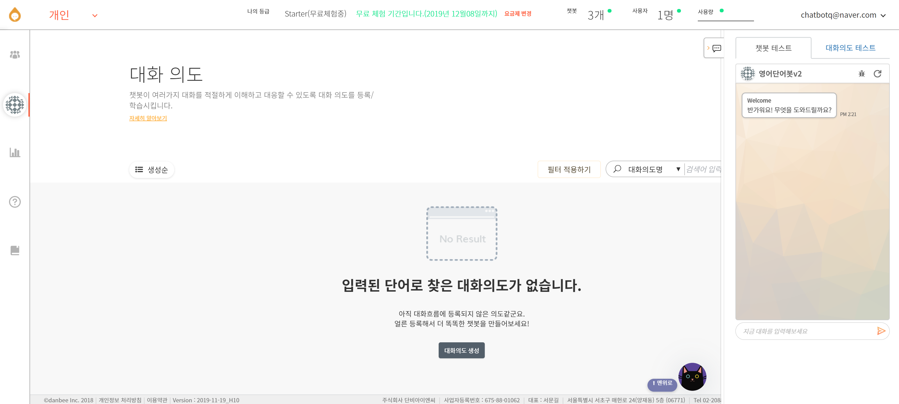

여기까지 확인하셨다면 챗봇을 하나 성공적으로 만드시게 된 겁니다. 사람과 기계가 대화 방식으로 상호작용할 수 있는 간단한 소프트웨어를 하나 만드신 것입니다. 축하드립니다! 

5-2) 대화의도(Intent)와 대화흐름(Chatflow) 작성

챗봇이 사람에게 말을 처음 건네는 부분을 만들어보겠습니다. 이 부분이 챗봇의 첫인상을 주는 부분이고, 챗봇이 무슨 기능을 하는지 사용자에게 알려주는 부분입니다. 앞의 그림으로 보자면 ‘반가워요! 무엇을 도와드릴까요?’라는 표현을 바꿔보는 것입니다.
화면의 왼쪽 ‘챗봇 생성/관리’ 메뉴의 하위 메뉴인 ‘대화의도’를 클릭하고, 화면 하단의 ‘대화의도 생성’ 버튼을 클릭합니다. 대화의도 생성 화면에서 입력해야 할 사항은 이름(greeting), 예문(안녕, 반갑습니다, 넌 누구 등), 버튼 이름(영어단어봇 인사) 등이고, ‘추론 후 답변’의 ‘답변 방식 설정’에서 ‘대화흐름에 연결’을 선택합니다. 그리고 ‘대화의도 생성’ 버튼을 클릭합니다.

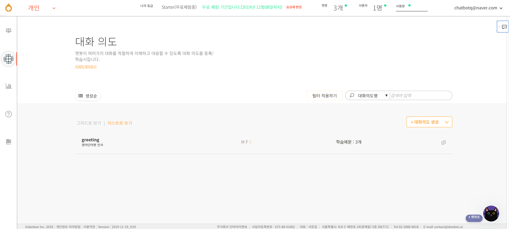

여기 대화의도 생성 부분이, 사람이 ‘개떡’(표현이 심한지 모르겠네요.^^)같이 말해도 챗봇이 ‘찰떡’같이 알아듣도록 만드는 부분입니다. 대화의도 생성시 사람들이 할 법한 말을 예문 목록에 등록한 후 챗봇을 학습시키면 사람들이 예문과 똑같지는 않지만 유사한 말을 할 경우에도 챗봇이 알아듣게 됩니다. 그래서 의도(Intent)라는 용어를 쓰고 있는 것입니다. 바로 Intent 부분이 소위 ‘인공지능’이 작동하는 부분 중에 하나입니다. 예문목록 등록이라는 것이 마치 영어 의사소통기능에 따른 예시문을 정리하는 것과 비슷합니다. 
‘대화흐름에 연결’ 부분을 활성화시킨 대화의도를 생성하고 나면 ‘대화흐름 생성’이라는 버튼이 생겨 있을 겁니다. 그 버튼을 클릭하면 방금 만든 greeting이라는 대화의도와 연결된 같은 이름의 ‘대화흐름’ 편집 화면으로 이동해 있을 것입니다. 만약 그렇지 않다면 왼쪽 메뉴의 ‘챗봇 생성/관리’의 챗봇제작 메뉴 중 ‘대화흐름’을 선택하세요.

대화흐름 화면의 가운데 부분이 대화흐름을 만드는 곳입니다. 여기에 처음에는 Listen Node와 Speak Node가 있습니다. 이것이 의미하는 바는 챗봇이 사람의 말을 listen한 후 speak한다는 것입니다. 그러므로 마우스를 이용하여 두 node를 연결시키고 Speak Node를 클릭한 후 챗봇이 말할 내용(챗봇 소개 및 인사)을 넣으면 됩니다. 
다음 화면이 Speak Node 수정화면입니다. 기본답변이 '사용'으로 선택된 것을 확인한 후 기본답변의 내용을 적으면 됩니다. '안녕하세요. 영어단어봇입니다. 만나서 반갑습니다.'라는 표현을 넣어보았습니다. 그리고 챗봇이 같은 말을 반복하면 재미없을 것 같아서 'Random 메시지 추가' 버튼을 눌러 또 다른 표현을 넣어보았습니다. 이렇게 되면 챗봇 답변으로 두 답변 중 무작위로 하나가 선택되게 됩니다. Speak Node에서 챗봇이 할 말을 다 작성했다면 화면 상단의 녹색 체크 부분을 클릭하여 ‘반영확인’을 하고 ‘변경내용 저장’ 버튼을 눌러 대화흐름을 저장하세요. (챗봇을 만들다보면 저장하라는 메시지를 많이 보게 될 겁니다. 특별한 이유가 없다면 자주 저장하는 것이 좋습니다.) 그런 후 화면 우측의 대화창을 실행한 후 대화 입력 부분에 ‘안녕’이라고 타이핑해보세요. 그러면 다음과 같은 챗봇의 대화를 볼 수 있을 것입니다. 그러면 성공입니다.

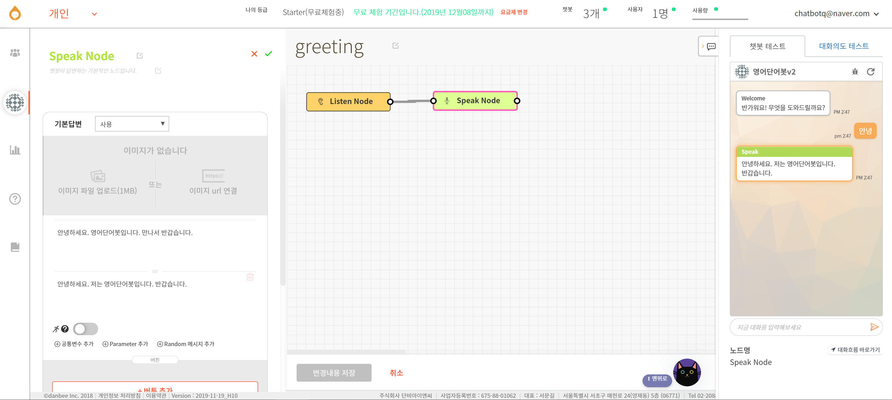

이 ‘안녕’이라는 표현이 대화의도 생성시 넣었던 예문입니다. ‘안녕’ 대신에 ‘안녕하세요’도 인식할 수 있을 것이고, ‘반갑습니다’ 대신에 ‘반갑’이라고 해도 될 겁니다. 이런 것이 인공지능식 답변이지요. 그런데 ‘하이’를 넣었더니 인식하지 못하네요. 그러면 어떻게 하면 될까요? 예. 맞습니다. ‘대화의도’ 메뉴에서 greeting 의도를 선택한 후 예문목록에 ‘하이’를 추가하면 됩니다. 한번 예문을 추가해보세요. 그리고 챗봇을 테스트해보세요.

5-3) 대화흐름을 이용한 챗봇의 기본답변 수정

방금 만든 greeting 대화흐름의 Speak Node 내용을 챗봇이 처음 실행될 때 나오게 하면 좋겠습니다. 왜냐하면 greeting의 Speak Node 내용이 챗봇이 자신을 소개하면서 인사를 하는 내용으로 적당해서요. 이렇게 하기 위해 왼쪽 메뉴에서 ‘챗봇제작 > 시작메시지’을 선택합니다. 그러면 ‘시작메시지’로 ‘간단 인사말’이 체크되어 있을 것이고, 그 밑에 인사말이 있을 겁니다. 아마도 그 인사말이 챗봇이 시작하면서 하는 인사말인 ‘반가워요! 무엇을 도와드릴까요?’일 겁니다.
챗봇의 인사말을 바꾸는 것은 생각보다 간단합니다. ‘간단 인사말’ 대신에 옆에 있는 ‘대화흐름 연결’을 선택하시고, 바로 밑의 풀다운 메뉴에서 대화흐름인 greeting을 선택해주세요. 그런 다음 ‘변경내용 저장’을 클릭한 챗봇 테스트 화면에서 둥그런 화살표 모양인 초기화 버튼을 눌러보세요.

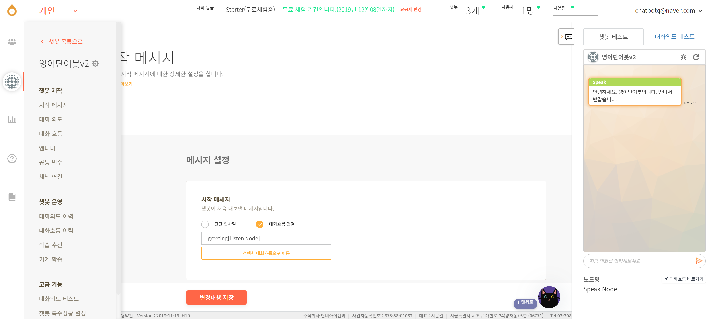

챗봇이 잘 작동되나요? 그렇다면 다행입니다. 이처럼 시작메시지를 간단한 인사말 대신에 대화흐름으로 구태여 바꾼 이유가 있습니다. greeting의 Speak Node에 인사말과 함께 ‘단어문제 풀기’ 버튼도 보여주고, 다른 버튼(영어단어봇 소개, 종료하기 등)도 함께 보여주기 위해서입니다. 이렇게 되면 영어단어봇이 처음 실행되면서 인사말과 함께 여러 버튼이 보여지게 되어 학생들이 바로 문제 풀이 등의 활동을 시작할 수 있기 때문입니다.
한 가지 추가적으로 말씀드리면, 시작메시지의 답변을 대화흐름으로 바꾼 것처럼 챗봇이 잘 알아듣지 못했을 때 하는 말도 바꿔볼 수 있습니다. 이를 위해 ‘챗봇 생성/관리’ 중 ‘고급기능’ 하위 메뉴 중에서 ‘챗봇 추론 설정’ 부분을 선택한 후 ‘추론 실패 대응’ 메시지를 수정(예를 들어, ‘제가 아직 부족한 점이 많습니다. 열심히 배우겠습니다.’)해보세요. 또는 새로운 대화흐름을 만들어 추론 실패시 대응할 수 있습니다.

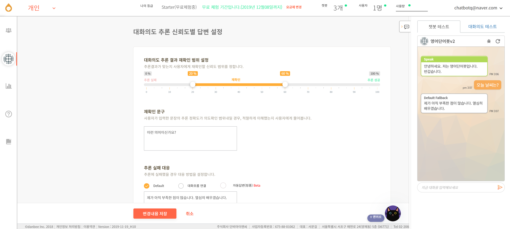

덤으로 하나 더 말씀드리면, 앞의 화면에서 ‘추론 실패 대응’으로 ‘자동답변(핑퐁)’을 선택하시면 핑퐁에서 제공하는 엉뚱하고 발랄한 챗봇 대화를 활용할 수 있습니다.

5-4) 단어 문제를 위한 의도와 대화흐름 작성 

5-2번을 따라 대화의도와 대화흐름을 만들어보셨거나 이해하셨다면 이번 부분에서 설명드릴 단어 문제를 위한 대화의도와 대화흐름에 대한 기본적인 이해를 갖고 계신다고 보면 됩니다. 다만, 대화흐름이 좀 복잡해질 뿐입니다. 먼저 다음과 같은 내용으로 대화의도를 만들어보겠습니다.

* 대화의도 이름: q01
* 예문목록: treatment
* 대화흐름에 연결, 체크  
* 버튼 이름: 문제 01 - treatment

대화의도 이름을 ‘q01’로 정한 것은 대화의도 목록에서 문제 번호를 쉽게 알아보기 위해서입니다. 예문으로 ‘treatment’를 넣은 이유는 대화창에서 treatment라고 입력할 경우 이 문제를 대화창에 바로 불러내기 위해서입니다. ‘대화흐름에 연결’을 체크하면 대화의도와 같은 이름을 가진 대화흐름이 만들어지게 됩니다. 즉, ‘q01’이라는 대화의도와 ‘q01’이라는 대화흐름이 생성되어 서로 연결되게 됩니다. 버튼 이름을 ‘문제 01 – treatment’라고 정한 것은 챗봇 대화창에서 문제가 버튼으로 제시될 경우에 문제 번호와 문제에서 다루는 단어를 함께 보여주기 위해서입니다. 위의 과정을 통해 ‘q01’ 대화의도를 만들어 저장하셨다면 작업화면에 있는 '연결된 대화흐름으로 이동' 부분을 클릭하시던지 아니면 왼쪽 메뉴목록에서 '대화흐름 목록'으로 가서 ‘q01’을 선택하시기 바랍니다.

대화흐름이라는 것은 챗봇과 사용자간의 대화가 여러 번에 걸쳐 이루어지도록 설계하는 곳입니다. 대화흐름 ‘q01’을 만들 것을 생각하면서 선생님이 학생에게 단어 문제를 내는 가상의 대화를 구성해보겠습니다.

선생님: 문제를 푸는 방식으로 교과서 본문에 나오는 단어를 공부해보겠습니다. 1번 단어 문제 나갑니다. treatment와 관련된 다음의 보기 중 옳지 않은 것이 무엇일까요?
 ① treat‧ment처럼 2음절로 발음된다.
 ② care와 비슷한 뜻을 갖고 있다.
 ③ medical, patient와 같은 단어와 함께 쓰이는 경우가 많다.
 ④ What is wrong with the treatmentes?
학생: 1번이요.
선생님: 그래요? 아쉽네요. 정답이 아닙니다. 힌트를 줄게요. treat(치료하다)는 동사입니다. 그리고 명사를 만들 때 많이 쓰이는 ment는 따로 발음이 됩니다. 자, 문제를 다시 풀어 볼래요? 아니면 treatment에 대해 설명해줄까요? 아니면 다음 문제로 갈까요?
학생: (선생님이 제시한 선택 중에서)문제를 다시 풀래요.
선생님: 그래요. 문제 다시 나갑니다. treatment와 관련된 다음의 보기 중 옳지 않은 것이 무엇일까요?
 ① treat‧ment처럼 2음절로 발음된다.
 ② care와 비슷한 뜻을 갖고 있다.
 ③ medical, patient와 같은 단어와 함께 쓰이는 경우가 많다.
 ④ What is wrong with the treatmentes?
학생: 4번이요.
선생님: 와! 맞았어요. 잘했어요! 4번이 옳지 않은 보기입니다. 자음 t로 끝나는 단어의 복수형을 어떻게 만드는지 생각해보면 되지요. 보기처럼 treatmentes라고 쓰면 안 되고, treatments라고 써야 합니다. 그러면 문제 다시 풀래요? 아니면 treatment에 대해 더 설명해줄까요? 아니면 다음 문제로 갈까요?
학생: (선생님이 제시한 선택 중에서 하나를 고른다. 선택에 따라 이후 단계를 진행한다.)

어찌 가상 대화가 그럴 듯한가요? 그러기를 기대해봅니다. 그런데 이런 대화가 그럴 듯하더라도 선생님이 학생과 이렇게 대화를 나누면서 단어 문제를 내기는 쉽지 않을 겁니다. 시간이 많이 걸리기 때문이지요. 영어단어봇을 만들어 활용해볼 것을 제안드리는 것이 바로 그 이유 때문입니다. 선생님이 하기 어려운 반복적인 교육 활동을 챗봇을 이용해서 해보는 것이지요. 그리고 학생들도 정답 확인이나 자료 조사와 같은 인지적, 시간적 부담을 줄이면서요.

다음 그림은 앞의 가상 대화를 ‘q01’의 대화흐름으로 구성해본 것입니다.

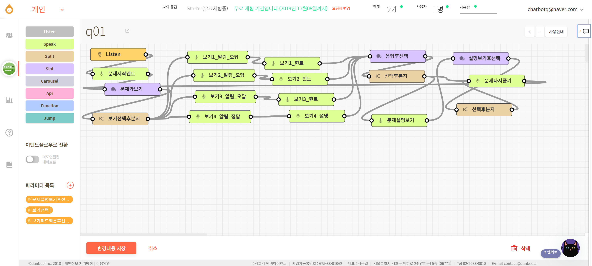

q01 대화흐름의 세부 내용을 보여주는 이 그림에서 사각형 모양의 각각의 노드는 챗봇의 세부적인 작동 단위입니다. 연두색 노드(Speak Node)와 보라색 노드(Slot Node)의 내용은 챗봇 대화창에 보이고, 황색 노드(Split Node)의 내용은 대화창에 보이지 않습니다. 그러면 이 대화흐름을 쫓아가면서 설명드리겠습니다. 선생님과 학생의 가상 대화를 생각하면서 보시기 바랍니다.
챗봇이 사용자의 선택이나 말을 입력 받은(Listen) 후, 문제를 내겠다는 멘트(문제시작멘트)를 하고, 문제와 보기(문제와보기)를 제시합니다. 그러면 사용자가 ‘문제와보기’ 화면에서 보기를 고릅니다. 사용자가 선택한 보기에 따라 ‘보기선택후분지’에서 특정 보기로 분지가 되어 해당 보기의 알림(보기_알림)이 보이고, 이어 해당 보기 관련한 힌트 또는 설명(보기_힌트/설명)이 제공됩니다. 이후 챗봇은 ‘응답후선택’ 노드에서 사용자에게 선택 목록을 제시합니다, 이 목록(응답후선택)에서 사용자가 선택하면 ‘선택후분지’를 통해 ‘문제다시풀기’ 또는 ‘문제설명보기’로 이동하게 됩니다. 이런 일련의 과정은 노드와 노드를 연결하는 선을 통해 짐작해볼 수 있습니다. 
대화흐름의 각 노드의 이름은 해당 노드를 더블클릭해서 나타나는 창에서 수정할 수 있습니다. 예를 들어, ‘Listen’이라는 노드 이름을 ‘듣기’로 바꿀 수 있습니다. 그리고 해당 창에서 노드의 대화가 어떻게 진행되는지 세부적으로 알 수 있습니다. 그러면 하나의 예로 문제를 보여주는 ‘문제와보기’ 노드의 내용은 어떨까요? 다음 그림에서 확인해보시기 바랍니다.

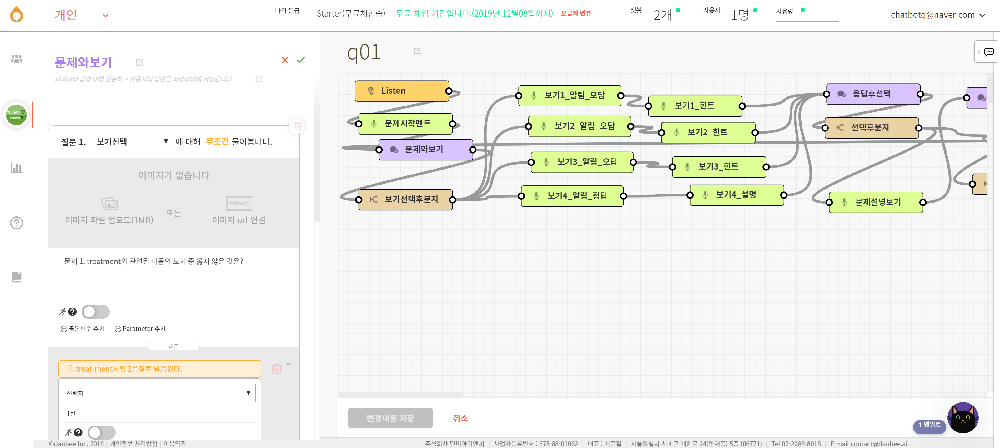

‘문제와보기’ 노드의 내용(질문 설정)을 보면, 문제의 지시문이 있고, 각각의 보기는 버튼으로 제시되고 있습니다. 챗봇 사용자들은 문제를 읽고 보기 버튼 중에 하나를 선택하게 됩니다. 그러면 챗봇은 각 보기에 따라 ‘1번, 2번, 3번, 4번’ 중에 하나의 값을 버튼 선택지의 값으로 갖게 됩니다. 이 값이 ‘질문 1.’ 옆에 있는 ‘보기선택’이라는 파라미터(parameter, 변수)의 값이 되는 것입니다. 즉, 챗봇은 파라미터를 사용하여 사용자가 보기 중에 몇 번을 선택했는지 ‘기억’하게 되는 것입니다. 챗봇은 파라미터의 값에 따라 ‘보기선택후분지’ 과정을 거쳐 선택한 보기에 맞는 알림과 힌트/설명을 제공하게 되는 것입니다. 그러므로 영어단어봇은 slot 노드인 보라색 노드와 파라미터를 활용하여 사용자가 선택한 값들을 참고하면서 대화를 하는 나름 똑똑한 챗봇이 되는 것입니다. 

다음 그림에는 q01 대화흐름에 챗봇 대화창 화면이 추가되었습니다. q01 대화흐름 중 ‘문제시작멘트’부터 ‘보기1_힌트’까지의 내용이 챗봇과의 대화창에 어떻게 나타나는지 보실 수 있습니다. 앞의 그림에서 설명드린 내용을 참고하시면서 다음 그림의 대화를 분석해보시기 바랍니다.

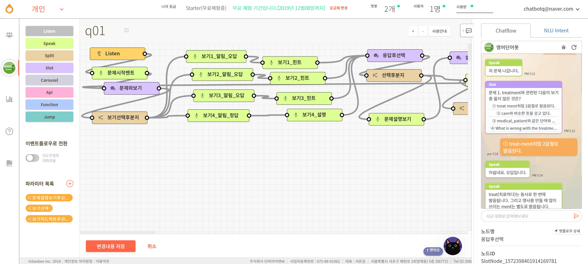

챗봇과 사용자의 대화가 매끄럽게 이루어지게 하기 위해서는 대화흐름의 각 노드의 기능을 잘 알고 해당 노드에 적용될 수 있는 내용을 잘 넣어야 합니다. 예를 들어, 대화흐름에서 파라미터를 설정한 후 slot 노드인 ‘문제와보기’ 노드에서 설정한 파라미터를 잘 사용해야 대화가 제대로 이어지게 됩니다. q01 대화흐름의 경우 3개의 slot 노드를 쓰면서 파라미터도 3개(앞의 화면의 왼쪽 아래 ‘파라미터 목록’ 부분)를 설정하여 사용하고 있습니다. 파라미터 설정 관련한 또 다른 예로 split 노드인 ‘보기선택후분지’ 노드에서 파라미터에 맞춰 speak 노드인 ‘보기_알림’ 노드를 잘 연결시켜주어야 합니다. (여기에서 선택지의 값과 보기_알림 부분이 잘못 연결되면 잘못된 문제가 됩니다.) 파라미터 설정 부분이 난이도가 좀 있는 부분이 아닐까 싶습니다. 추후에 파라미터를 설정하지 않고 대화흐름을 좀 더 쉽게 만들 수 있는 방법이 있을지 알아보겠습니다. 
지금까지 설명드린 단비의 대화흐름에서 챗봇은 말을 하거나(텍스트를 보여주거나) 버튼을 제공하고 있고, 사용자는 말은 하지 않고(문자를 타이핑하지 않고) 버튼을 누르면서 상호작용을 합니다. 이런 방식은 사용자에게 타이핑 부담을 주지 않아 좋고, 오타로 인한 오류를 피할 수 있는 장점이 있습니다. 더 나아가 버튼을 이용한 리치 인터액션 방식을 확장해서 사용자가 버튼을 눌러 다음 문제로 가게 하거나, 챗봇의 초기 화면으로 갈 수 있게 하면 좋을 것 같습니다. 이에 대한 내용이 다음 5-5번에서 설명드릴 내용입니다.

5-5) 추가적인 대화의도/대화흐름 작성 및 대화흐름 연결 

5-4번에서 첫 번째 단어 문제를 위한 q01 대화의도와 q01 대화흐름을 만드는 방법을 설명드렸습니다. 나머지 단어 문제(q02 ~ q10)의 경우 q01 대화의도를 복사한 후 내용을 수정하면 됩니다. 대화의도를 복사할 경우 대화흐름도 함께 복사되니 복사된 대화흐름을 수정하시고요. 수정할 때 각 문제의 정답 번호도 달라지니 split 노드 수정시 주의하시기 바랍니다. 
각 단어 문제에 대한 대화의도와 대화흐름을 만들게 되면 greeting과 q01부터 q10까지 모두 11개의 대화의도와 대화흐름이 만들어지게 됩니다. 그렇다면 사용자로 하여금 어떻게 greeting에서 q01으로 이동하고, q01에서 다음 문제로 가게 할 수 있을까요? 그래서 이번 부분에서는 이동을 위해 대화흐름을 연결하는 방법에 대해 설명드리겠습니다. 생각보다 간단합니다. 다음 그림을 보시지요.

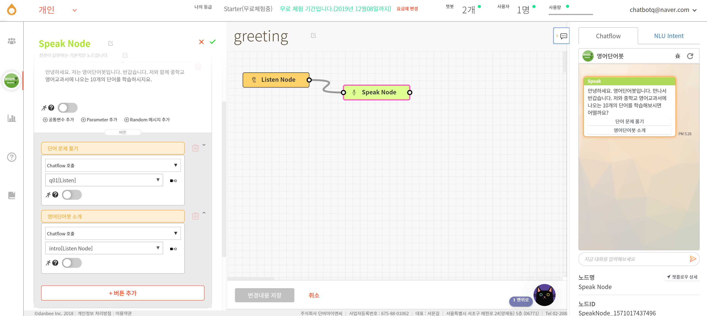

이 그림은 앞의 그림인 ‘Greeting 대화흐름 Speak Node 수정 화면’에 내용이 추가된 것입니다. 대화흐름에 어느 부분이 추가되었는지 알아보실 수 있나요? 바로 버튼이 추가되었습니다. 첫 번째 버튼으로 ‘단어 문제 풀기’ 버튼이 있고, 관련 내용으로 ‘Chatflow 호출’, ‘q01[Listen]’이 있습니다. 다음 버튼은 ‘영어단어봇 소개’이고요. 이런 greeting 대화흐름이 챗봇 대화창에 어떻게 나오는지 화면 우측을 보면 아실 수 있습니다. 그러면 이 부분이 어떻게 작동되는지 설명드리겠습니다.
앞에서 챗봇이 처음 실행될 때 챗봇이 하는 말인 시작메시지로 ‘간단 인사말’ 대신에 greeting 대화흐름을 지정해두었습니다. 그러므로 챗봇을 처음 실행하면 greeting 대화흐름의 speak node의 내용이 뜨게 됩니다. 그런데 이번에 greeting 대화흐름의 speak node 내용으로 버튼을 추가하였기 때문에 인사말과 함께 버튼(단어 문제 풀기)이 뜨게 됩니다. 사용자가 이 버튼을 누르면 챗봇은 버튼에 연결된 q01 대화흐름을 호출하게 됩니다. 즉 q01 대화흐름이 실행되면서 첫 번째 단어 문제가 제시되는 것입니다. 이처럼 대화흐름을 호출하는 버튼을 추가하기만 하면 대화흐름이 연결되는 것입니다. 제가 말씀드린 대로 대화흐름을 연결하는 방법이 간단하지요. 대화흐름을 만들고 연결하는 것에 익숙해지셨다면 영어단어봇을 소개하는 대화흐름을 만들거나, 챗봇을 종료하기 전에 보여주고 싶은 내용을 대화흐름으로 만들어 사용할 수 있습니다.
복잡한 구조의 대화흐름을 만드는 경우에 가끔 대화가 어떻게 전개되도록 대화흐름을 만들었는지 혼란스러울 수도 있습니다. 그럴 경우 대화흐름의 각 노드들을 열어보면서 확인하게 됩니다. 이런 과정은 꽤나 노동집약적인 활동입니다. 챗봇을 개발하는데 있어 분명 개선이 필요한 부분입니다. 향후에 이런 부분들이 어떻게 개선되는지 살펴볼 필요가 있습니다.

## 4부. 챗봇의 활용

6) 아는 사람에게 챗봇 테스트를 부탁한다.

‘구슬이 서말이라도 꿰어야 보배’라는 말이 있지요. 영어로 ‘Nothing is complete unless you put it in final shape.’라고 하면 될까요? 이 말을 챗봇에 적용한다면, ‘열심히 만든 챗봇, 쓰지 않으면 무용지물’이 되겠지요. 챗봇을 유용하게 쓴다는 것은 사람들이 챗봇과 대화를 나눠 효과를 얻는 것입니다. 혼자 공부하기 쉽지 않은 영어 단어 공부를 챗봇과 함께 하는 것이 영어단어봇의 효과일 것입니다.
만든 챗봇을 아는 사람에게 보내 테스트를 하는 방법은 간단합니다. 챗봇을 실행할 수 있는 링크를 복사해서 SNS나 문자, 또는 이메일로 보내주면 됩니다. 다음 그림은 단비의 채널 설정 화면입니다. 화면을 보면 단비에서 만든 챗봇을 사용할 수 있는 채널이 꽤 많습니다. 그중에서 맨 위 가운데에 있는 Frogue를 활성화시킨 후 톱니 부분을 클릭하면 팝업 화면이 뜨면서 URL 주소를 복사할 수 있습니다. 복사한 주소를 아는 사람에게 보내면 됩니다. 그러면 링크를 받은 사람은 URL을 클릭하여 챗봇을 실행하게 됩니다.

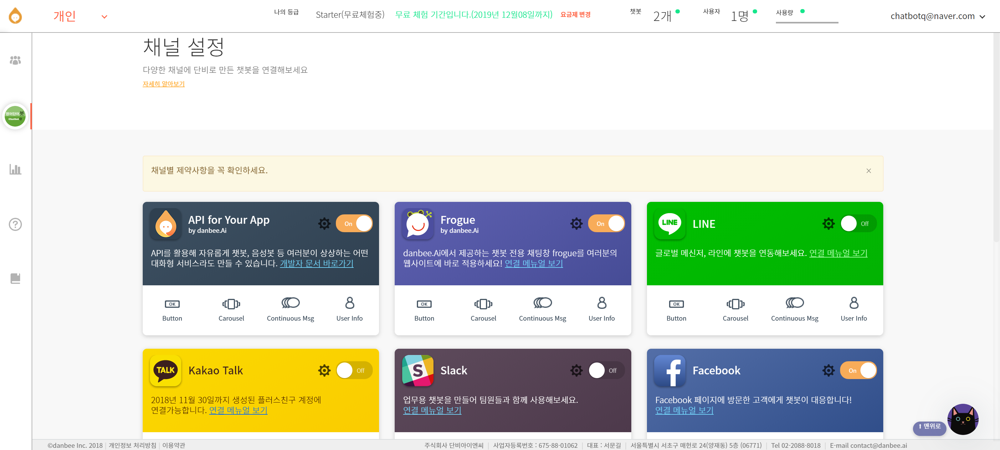

참고로 팝업 화면의 중간을 보면 챗봇을 실행할 수 있는 QR코드 이미지를 다운로드할 수 있는 링크가 있고, 웹사이트에 챗봇을 포함시킬 수 있는 Embed 코드도 제공하고 있습니다. 다음 그림에 있는 QR코드를 읽으면 영어단어봇이 실행됩니다.

7) 목표 사용자에게 챗봇을 알린다.

테스트를 거쳐 영어단어봇을 완성한 후 학생들에게 영어단어봇을 알리는 것이 공식적인 챗봇 사용이 될 겁니다. 이를 위해 이전 테스트 단계에서 하셨던 대로 챗봇 링크를 보내는 방법이 간단하고 편리합니다. 그렇게 해서 챗봇을 사용하시면 됩니다. 그런데 링크를 보내는 방식이 왠지 공식적인 방법처럼 느껴지지 않을 수도 있습니다. 그렇다면 어떤 방식이 공식적인 방법처럼 느껴질까요? 챗봇이니까 대화가 많이 이루어지는 SNS에 만든 챗봇을 배치하면 공식적인 데뷔처럼 느껴지지 않을까요? 현재 챗봇 사용에 호의적이고 사람들이 실제로 챗봇을 많이 쓰고 있는 SNS은 페이스북입니다. 이 부분은 또 다른 설명이 필요한 사항이라 글이 길어질 것 같아 단비의 설명자료로 대체하고자 합니다.https://doc.danbee.ai/channel_facebook.html
페이스북 이외에 텔레그램, 네이버톡톡, 카카오톡, 라인 등에서도 단비로 만든 챗봇을 사용할 수 있습니다. 각각의 경우 챗봇을 연결시키는 방법과 제약사항을 확인하시고 챗봇을 연결하셔야 합니다. 이런 연결 부분이 아직까지 간단하지 않습니다. 역시 개선과 발전이 필요한 부분입니다.

8) 챗봇에 대한 사용자의 피드백에 귀 기울인다
9) 다음에 챗봇을 업데이트할 경우를 위해 개선점을 생각해둔다

챗봇 운영 관련하여 비교가 될 수 있는 이야기부터 할까 합니다. 우리나라에 사이버대학교가 많습니다. 그런 사이버대학교의 초창기에 많은 교수님들이 강의 콘텐츠를 잘 만들면 좋은 강의가 될 것으로 생각하셨답니다. 그런데, 실제 상황을 보니 좋은 강의에 있어 좋은 강의 콘텐츠의 역할이 절반이고, 나머지 절반이 좋은 강의 운영이라는 것을 느끼게 되셨다고 합니다. 같은 관점을 챗봇에도 적용할 수 있을 것 같습니다. 좋은 챗봇을 만드는 것이 절반이고, 만든 챗봇을 잘 운영하는 것이 또 다른 절반이 되지 않을까 싶습니다. 이제까지 좋은 챗봇 만드는 것을 설명드렸습니다. 그러면 나머지 절반인 챗봇을 잘 운영하려면 어떻게 해야 할까요? 챗봇 사용 현황을 모니터링하면서 적절하게 대처하는 것일 겁니다. 단비 챗봇 개발 화면의 왼쪽 메뉴를 보면 바 차트 아이콘의 ‘애널리틱스’ 메뉴가 있습니다. 해당 메뉴를 클릭하면 하위 메뉴로 처리량 통계, 학습 통계, 대화 통계가 나옵니다. 

* 처리량 통계: 챗봇과 챗봇의 의도, 대화흐름의 사용량 관련 정보 제공
* 학습 통계: 의도추론 현황 정보 제공
* 대화 통계: 챗봇 사용자가 타이핑한 단어나 표현을 워드 클라우드로 제공

각 메뉴의 내용을 살펴보면 사람들이 챗봇을 어떻게 사용하고 있는지 대략 파악할 수 있습니다. 그리고 파악된 사항을 바탕으로 챗봇을 업데이트할 수 있습니다. 물론 챗봇 사용자들이 별도로 주는 피드백도 꼼꼼히 적어두었다가 챗봇를 업데이트할 때 반영하는 것이 좋겠고요.

이상으로 챗봇빌더인 단비를 이용하여 간단한 챗봇인 영어단어봇 만드는 과정을 설명드렸습니다. 대화형 인터페이스인 챗봇은 사람들이 기계를 편리하게 사용할 수 있게 해주는 인터페이스라서 앞으로 많이 이용할 것 같습니다. 챗봇이 글자나 말을 이용하는 만큼 영어교육을 전공하는 분들이 관심을 갖고 활용해보면 좋을 것 같습니다.

## 참고자료

* [Wiktionary](https://en.wiktionary.org/) 각 단어의 페이지에서 오디오 파일을 확인하고 다운로그 가능합니다.
* [Project Shtooka](http://shtooka.net/) 압축된 오디오 파일을 내려받을 수 있습니다.

