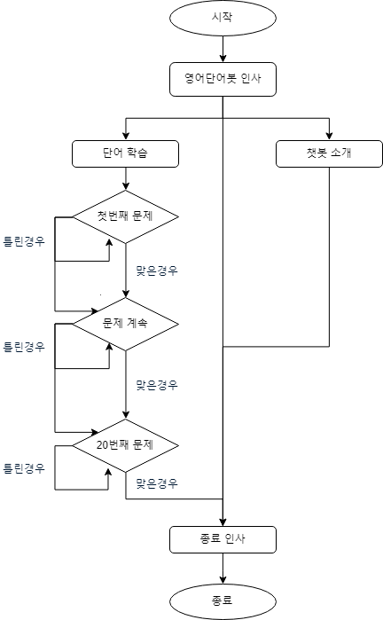

# 챗봇Q-영어단어봇 제작 및 활용

요즘 기계와 상호작용하는 방식 중에 하나인 대화형 인터페이스가 부각되면서 챗봇의 활용 가능성이 높아지고 있습니다. 그러면 그런 챗봇을 어떻게 만들까요? 이 질문에 대한 답변이 영어교육을 전공하는 분들게 도움이 되기를 바랍니다.

## 1부. 챗봇의 기획

챗봇(chatbot)은 말하는 로봇(chatting robot)의 줄인 말로 언어를 통해 상호작용하는 사람들의 속성을 반영하여 만들어진 소프트웨어입니다. 촘스키(Chomsky)의 언어학에서부터 시작된 자연어 처리(natural language processing) 지식이 발전하고 기계학습(machine learning) 알고리즘이 계속 연구되어 오다가 하드웨어와 네트워크가 발전하면서 상상할 수 없는 대규모의 언어 데이터가 쌓이다보니 대화를 나눌 만한 챗봇을 만드는 것이 가능해졌습니다. 또한 검색 기술의 정교함도 챗봇 개발에 한몫을 하지 않았을까 싶습니다. 왜냐하면 사람의 말에 챗봇이 응답한다는 것이, 관점을 달리해서 생각해보면, 사람의 검색 요청에 한 개의 검색 결과를 보여주는 것이라고 볼 수도 있으니까요. 챗봇이라는 것이 한 개의 검색 결과로 승부(?)하는 일종의 기술의 자신감이라고 볼 수 있을지 모르겠네요.

우리의 대화는 보통 말을 서로 한 번씩 주고받음으로써 이루어집니다. 예를 들어 다음과 같은 경우이지요.

A: 화장실이 어디인가요?
B: 엘리베이터 건너편에 있습니다.

한번 위 대화를 마음속으로 해보세요. 혼자 하더라도 마치 남과 대화하는 것처럼 말하게 됩니다. 대화가 우리 사람들의 속성이라는 것을 느낄 수 있을 겁니다. 우리의 대화가 이와 같이 하나의 대화쌍으로 끝나는 경우도 있지만, 여러 대화쌍으로 대화가 이루어지는 경우도 많습니다. 오늘이나 어제 누군가와 대화를 나누셨던 기억을 떠올리면 쉽게 짐작하실 수 있을 겁니다. 또는 대화쌍의 구체적인 모습으로 연극 대본이나 영화 시나리오를 생각해봐도 됩니다.
챗봇이 대화 상대방이 된다면 대화쌍 중 한 부분을 챗봇이 담당하게 됩니다. 예를 들어, 건물 복도를 어슬렁거리는 바퀴가 달린 로봇이 있어서 로봇에게 ‘화장실이 어디인가요?’라고 물을 때 로봇이 ‘엘리베이터 건너편에 있습니다.’라고 답을 할 수 있겠지요. 이처럼 챗봇은 스마트폰에도 있고, 스마트스피커에도 있을 수 있지만, 로봇에 내장될 수도 있습니다. 즉, 챗봇은 대화형 인터페이스를 활용하는 소프트웨어라는 얘기지요.
현재의 기술 수준에서 챗봇이 모든 주제에 대해 대화를 나누기에는 한계가 뚜렷합니다. 스마트폰에서 챗봇을 사용하실 수 있다면 챗봇과 대화를 한번 나눠보세요. 대화를 좀 하다보면, 챗봇이 ‘무슨 말인지 이해하지 못했습니다.’와 같은 응답을 하는 경우가 많을 겁니다. 아니면 ‘아무말 대잔치’를 할지도 모르고요. 하지만 챗봇은 특정 정보를 제공하는 측면에서는 능력을 발휘할 수도 있습니다. 언어의 기능을 정보 교환 기능과 사교 기능으로 나눠본다고 할 때 현재의 챗봇은 사교적인 대화 기능은 약하지만 특정 분야의 정보 제공 기능은 어느 정도 수행할 수 있습니다. 이상과 같은 챗봇의 기능과 현재의 한계를 생각해볼 때, 지금 수준에서 IT 전문가가 아닌 일반인들이 성공적인 챗봇을 만들려면 정보 제공을 주된 목적으로 하는 챗봇을 만드는 것이 좋습니다. 

챗봇 제작을 교육과정과 교재를 개발하는 관점에서 생각한다면, 정보 제공 측면에서 챗봇의 목적을 설정하고 대화형 교재나 콘텐츠로서 챗봇을 만든다고 생각해볼 수 있습니다. 영어교육 전문가로서 정보 제공을 목적으로 챗봇을 만든다고 할 때 무슨 챗봇을 만들어보면 좋을까요? IT 전문가가 아닌 일반인 수준에서 챗봇을 처음 만든다면 무언가(자기 자신, 모임, 기관 등)를 소개하는 챗봇을 만들어보면 좋을 것입니다. 또는 간단한 언어 자료를 이용하여 정형화된 방식으로 진행되는 영어 학습 챗봇을 만들어볼 수 있을 것입니다. 그래서 본 글에서는, 하나의 사례로, 객관식 문제를 이용한 영어 단어 학습 챗봇을 제작해보고자 합니다. 이 챗봇을 ‘영어단어봇’이라고 이름 지어 보겠습니다.

예시로 만들 영어단어봇의 대략적인 기획은 다음과 같습니다.

1. 대상자: 중학생
2. 학습 목표: 10개의 영어 어휘 학습
3. 대상 단어: treatment, drown, rope, breathe, lay, come around, hold on to, insect, try to, upward (출처: 천재 중3 영어교과서, Lesson 9, The ABCs of First Aid) 
4. 데이터: 10개 단어를 이용한 객관식 문제와 관련 자료
5. 챗봇 활용: 영어 수업을 마친 후 학생들이 개별적으로 챗봇과 영어 단어를 학습함 

영어단어봇을 처음 만들 때는 시간이 꽤 걸릴 겁니다. 하지만, 학생들에게 단어 공부를 그냥 맡겨두는 것이 아니라 학습 도구를 제공해주면서 단어 공부를 하라고 하면 학생들이 단어를 공부할 가능성이 커지지 않을까요? 그리고 이렇게 만든 챗봇이 유용하면 나중에는 학습할 단어만 바꾸면 되기 때문에 챗봇을 만드는데 걸리는 시간도 크게 줄어들 것입니다. 혼자가 아니라 여러 분들이 함께 영어단어봇을 만든다면 시간도 줄이면서 협업의 성과도 얻을 수 있기 때문에 괜찮을 것 같네요. 
‘단어 학습에 무슨 챗봇이 필요해?’라고 반문하실 수도 있습니다. ‘그냥 있는 자료로 활용해서 외우게 시키면 되지, 구태여 없는 시간 들여 챗봇을 만들 필요가 있을까?’라고 생각하실 수 있으실 겁니다. 이런 반문과 생각이 잘못된 것은 아닙니다. 자연스러운 것입니다. 챗봇 활용 학습은 충분히 검증되지 않은 새로운 방식이니까요. 다만, 이번 기회에 챗봇을 이용한 학습이라는 새로운 시도를 해보는 것은 어떨지요? 그 시도가 성과와 발전의 계기가 된다면 좋을 일입니다. 나중에 챗봇을 이용한 영어교육 연구와 개발, 그리고 사용이 일반화될 수도 있습니다. 그러니 첫 번째 펭귄처럼 지금 한 번 해보는 것도 괜찮을 것 같습니다.

이번의 챗봇 제작 프로젝트의 경우, 영어 단어 10개를 명시적으로 학습하는 경우이니 학습 요소를 명시적으로 나눈 구조주의적 접근법에 따라 교수설계를 하면 될 것 같습니다. 그리고 평가의 환류효과(washback effect)를 고려하여 객관식 문제를 푸는 방식으로 단어 학습을 하도록 챗봇을 설계하는 것이니 학생들은 챗봇과의 상호작용 방식이 익숙할 것입니다. 학생들은 편리할 때 스마트폰이나 컴퓨터에서 받은 챗봇 링크를 클릭하면 됩니다. 그러면 챗봇은 학생과 정해진 대화를 하면서 학생들에게 객관식 단어 문제를 제시하게 됩니다. 학생들은 문제를 풀게 되고, 챗봇은 학생들이 문제를 맞게 풀었는지 아닌지 알려주게 됩니다. 문제를 맞췄으면 다음 문제로 넘어가고, 틀렸으면 같은 문제를 다시 풀게 됩니다. 10문제가 동일한 과정으로 제시된 후 학습을 마치게 됩니다. 좀 더 공부하고 싶은 학생들은 챗봇과 함께 다시 문제를 풀면 됩니다. 이 과정을 순서도로 나타내면 다음과 같습니다.

만들고자 하는 영어단어봇이 처음 만드는 챗봇이기 때문에 기능을 간단하게 하였습니다. 챗봇 제작이 익숙해지거나 추가하고자 하는 기능이 생기면 좀 더 복잡한 챗봇을 만들 수 있을 것입니다. 또한 학생들이 입력하는 값(보기 선택, 문항 맞춤 여부 등)을 데이터베이스에 저장하여 학습 분석에 활용할 수도 있습니다.

챗봇을 제작하기 위해서는 제작 툴이 필요합니다. 제작 툴로써 전문적이고 어려운 수준에서는 Python과 같은 언어로 프로그래밍할 수 있는 에디터, 챗봇이 사용할 데이터가 저장되어 있는 데이터베이스, 그리고 온라인에서 챗봇을 사용할 수 있게 해주는 웹서버 등이 필요합니다. 하지만, IT 전문가가 아닌 일반인들이 챗봇을 제작하는 경우에는 보다 쉬운 방법이 필요합니다. 마치 워드프로세서나 WYSIWYG 방식의 웹페이지 제작 툴로, HTML 코드를 모르더라도, 웹페이지를 만드는 것처럼요. 챗봇 제작에서 쉬운 제작 방식이 바로 챗봇 빌더(builder)를 이용하는 것입니다.
 

## 2부. 챗봇 제작 환경 구축

이번 부분에서는 ‘챗봇 제작 환경 구축’ 방법으로 챗봇 빌더에 대해 알아보고자 합니다. 짐작하실까 모르겠는데요, 현재 다양한 챗봇 빌더들이 치열한 경쟁을 벌이고 있습니다. 왜냐하면 챗봇이라는 새로운 시장이 이제 막 열리고 있다고 생각하는 사람들이 많거든요.

그러면 다양한 빌더들 중에서 적당한 것을 고르기 위해 고려해야 할 사항으로 무엇이 있을까요? 제 나름대로 생각해본 항목을 적어보면 다음과 같습니다. 챗봇 빌더 선택시 고려사항은 다음 책의 내용을 바탕으로 하였습니다. 
김영우. (2019). AI 챗봇 빌더와 간단한 챗봇 제작. 김혜영 외, 영어학습을 위한 인공지능 챗봇 활용 및 제작 (pp. 117-143). 파주: 교육과학사. 

※ WYSIWYG 방식: 웹페이지를 만드셨던 경험이 있으신가요? 웹페이지를 만들 때 HTML 코드를 사용하셨나요? 만약 HTML 코드를 사용하지 않고 웹페이지를 만드셨다면 WYSIWYG 방식을 사용하셨을 겁니다. WYSIWYG라는 용어는 ‘What You See Is What You Get’의 각 단어의 첫 글자를 딴 두문자어(acronym)로 WYSIWYG 방식은 컴퓨터 언어를 직접 사용하지 않고 컴퓨터가 실행할 수 있는 결과물을 만드는 방식을 말합니다. 챗봇도 일종의 소프트웨어인데, 챗봇 빌더로 챗봇을 만들 때 Python과 같은 컴퓨터 언어로 코딩하지 않고 챗봇을 만든다면 WYSIWYG 방식으로 챗봇을 만든다고 볼 수 있습니다.
※ 무료 빌더: 챗봇에 대해 잘 모르는 경우에 처음부터 비용을 지불해야 하는 유료 챗봇 빌더는 부담스러울 수 있습니다. 영어단어봇처럼 기본적인 기능의 챗봇을 제작하는 데는 무료 챗봇 빌더면 충분하다고 생각합니다. 다만, 챗봇 사용량이 많아지거나 챗봇에 고급 기능을 추가하는 경우 어떻게 될지 미리 알아볼 필요는 있습니다. 혹시라도 나중에 만드신 챗봇이 많이 쓰이는 경우를 대비해서 말이죠.
※ 대화 구현 용이성: 챗봇은 대화를 주고받는 인터페이스인 만큼 챗봇 빌더를 이용하여 챗봇을 제작할 때 사람과 챗봇 사이에 예상되는 대화를 쉽게 구현할 수 있어야 합니다. 영어단어봇의 경우 챗봇이 대화를 통해 학생으로 하여금 객관식 문제를 풀면서 영어 단어를 학습할 수 있게 해주어야 합니다. 이 대목에서 챗봇에 대해 사람들이 갖고 있는 막연한 기대를 다시 한 번 명확히 할 필요가 있습니다. 챗봇이라는 것이 신비한 능력을 발휘하여 사람의 말에 응답하는 것이 아닙니다. 데이터와 알고리즘에 기반해서 답을 하는 것입니다. 아니면 주어진 대화 시나리오에 따라 답을 하는 것입니다. 또는 요즘 많이 쓰이는 방식은 앞의 두 방식을 결합한 방식으로 대화 시나리오를 기반으로 하되 데이터/알고리즘을 적절하게 활용하여 답을 하는 방식입니다. 영어단어봇의 경우는 대화 시나리오에 따라 답을 하는 방식으로 만들게 됩니다. 데이터와 알고리즘을 활용하는 방식은 별로 쓰지 않을 것입니다. 이유는, 현재의 기술 수준에서, 10개의 단어 학습이라는 명확한 목표 달성을 위해서는 대화 시나리오 방식이 효율적이라고 생각하기 때문입니다. 하지만 향후에 챗봇의 활용도를 높이려면 데이터/알고리즘 활용 방식에 계속 관심을 둘 필요는 있습니다.
※ 리치 인터액션(rich interaction): 챗봇이 말로 대화를 제대로 할 수 없는 경우에 말 대신 버튼, 이미지, 이모티콘 등으로 사람과 상호작용을 할 수 있는데, 이를 리치 인터액션이라고 말합니다. 여기에서 리치(rich)라는 긍정적인 용어를 쓰고 있지만 챗봇의 부족한 대화 능력을 적절히 감추고자 할 때 리치 인터액션을 사용한다고 보면 됩니다. 이 글을 통해 만들 객관식 문제 풀이봇인 영어단어봇의 경우 리치 인터액션 개념을 응용하여 객관식 문제의 각 보기를 버튼으로 제공할 예정입니다.

※ 음성/문자 변환: 사람들이 챗봇과 대화할 때 글자만 쓰거나 말만 하는 것이 아니라 둘 다(텍스트 채팅과 보이스 채팅)를 함께 할 수 있으면 좋습니다. 관련하여 음성 문자 변환(Speech to Text, STT)과 문자 음성 변환(Text to Speech, TTS) 기능이 필요합니다. 현재는 텍스트 챗봇이 많은 상황이고, 영어단어봇도 텍스트 챗봇의 형태로 만들 것입니다. 하지만, 음성 챗봇의 가능성은 계속 커지고 있으니 지속적인 관심을 가질 필요가 있습니다. 그러므로 챗봇이 사용할 문장을 준비할 때 해당 문장이 텍스트로 제시되는 경우와 음성으로 제시되는 경우를 함께 생각해보는 것이 좋습니다.
※ 플랫폼 지원: 챗봇 빌더로 챗봇을 완성했다고 했을 때 이렇게 만든 챗봇을 어떻게 사용할 수 있을까요? 챗봇이 소프트웨어라고 하는데, 이 소프트웨어를 어떻게 실행할 수 있을까요? 이 대목에서 챗봇이 등장하게 된 배경을 생각해볼 필요가 있습니다. 최근에 사람들이 컴퓨터 대신에 스마트폰을 많이 쓰게 되었습니다. 그리고 최근 몇 년 사이에 사람들이 메시지앱(카카오톡, 페이스북 메신저, 텔레그램 등)을 아주 많이 쓰고 있습니다. 챗봇이 목표로 하는 가장 이상적인 상황은 사람들이 메시지앱에서 다른 사람들과 대화를 하듯이 챗봇과 대화하는 상황입니다. 그러므로 메시지앱에서 챗봇을 부르는 순간 챗봇이라는 소프트웨어가 실행되어 작동하는 것입니다. 다음으로, 챗봇을 만드는 입장에서는 만든 챗봇이 하나의 메시지앱이 아니라 여러 메시지앱에서 쓰일 수 있기를 바랄 것입니다. 이런 메시지앱을 플랫폼이라고 부를 수 있으므로 챗봇 빌더가 여러 플랫폼을 지원한다는 말의 의미는 챗봇 빌더로 만든 챗봇을 여러 플랫폼에서 사용할 수 있다는 말이 되는 것입니다. 이 대목에서 챗봇 관련 최근 상황을 말씀드리면 우리나라의 ‘국민SNS’라고 할 수 있는 카카오톡에서 챗봇 빌더로 만든 챗봇을 사용하는 것이 쉽지 않습니다. 그러다보니 우리나라 사람들이 챗봇에 아직 익숙하지 않은 것 같습니다. 반면, 페이스북 메신저나 텔레그램에서는 챗봇을 쉽게 사용할 수 있고요. 참고로 챗봇은 웹사이트 등에도 제공될 수 있습니다. 그래서 그런지 요즘 웹사이트를 다니다보면 화면 어딘가에 챗봇(또는 챗봇 형태의 캐릭터)이 대화하기를 기다리는 모양을 많이 보게 됩니다. 영어단어봇의 경우 메시지앱 내부에서 작동하는 방식이 아니라 메시지앱 모양의 화면에서 작동되는 방식으로 제공될 예정입니다. 이와 같은 기본 제공 방식 외에 여건이 되면 가능한 플랫폼에 탑재해서 사용해볼 수도 있습니다.

이제까지 말씀드린 고려사항을 참고하면서 챗봇 빌더를 알아보고 선택하면 좋지 않을까 싶습니다. 이 글은 챗봇 빌더를 비교하기보다는 챗봇을 실제로 만들어 보는 것을 목적으로 하는 만큼 몇 개의 챗봇 빌더를 간단하게 소개하고자 합니다. 가장 많이 알려진 챗봇 빌더는 아마도 구글의 Dialogflow(https://dialogflow.com/)가 아닐까 싶습니다. 이 챗봇 빌더의 원래 이름은 API.AI였는데 구글이 인수하면서 이름이 Dialogflow가 되었습니다. 구글 계정이 있으면 Dialogflow를 무료로 사용할 수 있습니다. Dialogflow의 경우 샘플도 많고, 인터넷에 검색해보면 참고할만한 자료도 많아 영어 전용 챗봇을 만들 경우 유용합니다. 다음으로 Chatfuel(https://chatfuel.com/)이 있습니다. Chatfuel을 이용해서 만든 챗봇은 주로 페이스북에서 사용할 수 있는 만큼 페이스북 활동을 많이 하는 사람들이 페이스북 페이지에서 활용하기 좋은 챗봇 빌더입니다. 플러그인이 많다는 점도 Chatfuel의 장점으로 꼽힙니다. Chatfuel과 비슷한 챗봇 빌더로 ManyChat(https://manychat.com/)도 있습니다. 그리고 판도라봇(Pandorabots)(https://www.pandorabots.com/)이라는 챗봇 빌더도 있는데, AIML(Artificial Intelligence Markup Language)이라는 언어로 만들어졌다는 특징을 갖고 있습니다. AIML은, 웹페이지를 만드는 HTML처럼, XML 언어를 챗봇 개발에 최적화시킨 언어로 HTML에 익숙하다면 시도해볼 수 있을 것입니다. 다음으로 국내 챗봇 빌더 중에 단비(https://danbee.ai/)가 있습니다. 단비는 LG CNS의 사내 벤처에서 출발하여 2017년에 사업을 본격적으로 시작한 회사로 한국어를 사용하는 챗봇을 제작하는데 최적화되어 있다고 볼 수 있습니다. 그 외 다른 챗봇 빌더가 많은데 챗봇 빌더에 대한 소개는 다른 기회에 하도록 하겠습니다. 
 
이 글에서는 앞에 소개한 챗봇 빌더 중에서 단비를 이용해서 챗봇 제작 환경을 구축하려고 합니다. 챗봇 빌더로 단비를 선택한 이유는 크게 세 가지로, 첫째는 단비의 대화흐름 방식이 대화 시나리오를 만들기 편리하기 때문입니다. 둘째는 단비가 한국 업체라서 챗봇을 만들면서 생기는 궁금증에 대해 상대적으로 쉽게 답변과 해결책을 얻을 수 있기 때문입니다. 단비 웹사이트 주소는 https://danbee.ai/입니다. 인공지능 관련 웹사이트의 도메인의 끝자리가 ai로 끝나는 경우가 많은데 단비 사이트도 같습니다. 단비 초기 화면에서 ‘danbee.AI 무료로 시작’을 누르면 회원 가입 화면으로 이동하게 되고, ‘오늘도 챗봇 키우기’ 또는 ‘danbee.AI 시작’을 누르면 로그인 화면으로 이동하게 됩니다. 단비 계정을 만드는 방법은 크게 두 가지로, 이메일을 ID로 하여 계정을 만드는 방식과 네이버 계정 등 잘 알려진 외부 계정을 이용해서 계정을 만드는 방식이 있습니다. 제 경우 처음에는 이메일을 ID로 하여 계정을 만들었다가 로그인할 때마다 보안을 위해 이메일로 받은 인증키를 입력해야 하는 불편함이 있어서 네이버 계정으로 또 다른 단비 계정을 만들어 사용하고 있습니다. 단비는 브라우저로 구글의 크롬을 추천하고 있으니 챗봇을 만들기 위해 단비 사이트에 접속할 때 구글 크롬을 이용하시기 바랍니다. 그리고 스마트폰으로 단비에 로그인할 수는 있으나 챗봇을 만들기 위해서는 컴퓨터나 노트북에서 단비 사이트에 로그인해야 합니다. 

이제까지 말씀드린 내용을 바탕으로 챗봇 제작을 위한 환경 설정 사항을 정리하면 다음과 같습니다.

● 컴퓨터나 노트북
● 인터넷 연결
● 구글 크롬 (https://www.google.com/intl/ko/chrome/)
● 단비 (https://danbee.ai/) 계정

## 3부. 챗봇 제작

영어교육 분야에서 가끔 영어 지식(English usage)과 영어 사용(English use)을 비교하면서 선언적 지식(declarative knowledge)과 절차적 지식(procedural knowledge)에 대한 얘기를 합니다. 물론 이런 얘기를 통해 영어 사용의 중요성을 강조하는 경우가 많지요. 그러면서 관련 사례로 운전에 대한 지식이 많아도 운전하는 것이 더 중요하다는 얘기를 합니다. 이런 비교를 챗봇 개발에 적용해본다면 챗봇에 대해 아는 것보다 챗봇을 실제로 만들어보는 것이 더 중요하다고 얘기할 수 있겠지요. 이번 3부는 챗봇 개발의 절차적 지식을 익히는 과정입니다. 이해를 돕기 위해, 또 다른 절차적 지식으로 많이 언급되는, 음식 만드는 과정을 머릿속으로 상상해보시면서 다음 표를 보시겠습니다. 

* 영어 단어 목록 작성
  + 중학교 단어 (10개): treatment, drown, rope, breathe, lay, come around, hold on to, insect, try to, upward (출처: 천재 중3 영어교과서, Lesson 9, The ABCs of First Aid) 
  
* 각 단어의 자료 수집 및 정리
  + 항목: 발음, 품사, 의미, 영영풀이, 간단예문, 파생어, 파생전단어, 유의어, 반의어, 다른품사, 숙어, 연어, 시멘틱맵, 단어관련이미지, 교과서예문, 문장성분, 예문해석
  + 위 항목은 필요에 따라 줄이거나 늘릴 수 있습니다.
  + 발음의 경우 발음기호와 함께 단어를 발음한 오디오 파일을 확보합니다.
    - [Wiktionary](https://en.wiktionary.org/) 각 단어의 페이지에서 오디오 파일을 확인하고 다운로그 가능합니다.
    - [Project Shtooka](http://shtooka.net/) 압축된 오디오 파일을 내려받을 수 있습니다.
  + 단어 자료를 아래한글이나 워드 파일로 작성할 수도 있으나 단어 관련 데이터를 수집하고 활용한다는 측면에서 엑셀과 같은 스프레드시트 파일로 작성하는 것을 추천합니다.

* 각 단어별 객관식 문제 제작
  + 항목: 지시문, 보기1, 보기2, 보기3, 보기4, 틀린보기힌트 3개, 정답, 문제설명, 문제관련추가자료
  + 문제 파일(HWP파일): [EnglishWordQuizMaterials.hwp](EnglishWordQuizMaterials.hwp)

1) 목표 사용자를 위해 만들 챗봇(우리는 영어단어봇)을 정한다.
2) 챗봇을 만들 수 있는 곳(챗봇빌더 사이트, 단비)으로 간다.
3) 챗봇빌더 사이트에 로그인한다.
4) 챗봇 제작에 필요한 요소를 파악한다.

이제 챗봇을 만들어보겠습니다.

### 챗봇 제작

5) 챗봇을 제작한다.

5-1) 챗봇의 초기 설정

5-2) 의도(Intent)와 대화흐름(Chatflow) 작성

5-3) 대화흐름을 이용한 챗봇의 기본답변 수정

5-4) 단어 문제를 위한 의도와 대화흐름 작성 

5-5) 추가적인 의도/대화흐름 작성 및 대화흐름 연결 

6) 아는 사람에게 챗봇 테스트를 부탁한다.

7) 목표 사용자에게 챗봇을 알린다.

8) 챗봇에 대한 사용자의 피드백에 귀 기울인다

9) 다음에 챗봇을 업데이트할 경우를 위해 개선점을 생각해둔다

