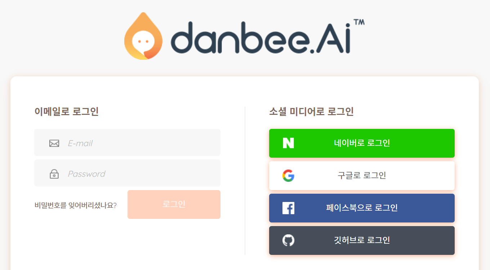

# 영어단어봇 제작
챗봇 제작 실습으로 영어 교과서 본문에 나오는 단어를 학습하는데 도움을 주는 챗봇을 만들어봅니다.

## 제작 단계

### 영어 단어 자료 준비

* 영어 단어 목록 작성
  + 중학교 단어 (10개): treatment, drown, rope, breathe, lay, come around, hold on to, insect, try to, upward (출처: 천재 중3 영어교과서, Lesson 9, The ABCs of First Aid) 
  
* 각 단어의 자료 수집 및 정리
  + 항목: 발음, 품사, 의미, 영영풀이, 간단예문, 파생어, 파생전단어, 유의어, 반의어, 다른품사, 숙어, 연어, 시멘틱맵, 단어관련이미지, 교과서예문, 문장성분, 예문해석
  + 위 항목은 필요에 따라 줄이거나 늘릴 수 있습니다.
  + 발음의 경우 발음기호와 함께 단어를 발음한 오디오 파일을 확보합니다.
    - [Wiktionary](https://en.wiktionary.org/) 각 단어의 페이지에서 오디오 파일을 확인하고 다운로그 가능합니다.
    - [Project Shtooka](http://shtooka.net/) 압축된 오디오 파일을 내려받을 수 있습니다.
  + 단어 자료를 아래한글이나 워드 파일로 작성할 수도 있으나 단어 관련 데이터를 수집하고 활용한다는 측면에서 엑셀과 같은 스프레드시트 파일로 작성하는 것을 추천합니다.

* 각 단어별 객관식 문제 제작
  + 항목: 지시문, 보기1, 보기2, 보기3, 보기4, 틀린보기힌트 3개, 정답, 문제설명, 문제관련추가자료
  + 문제 파일(HWP파일): [EnglishWordQuizMaterials.hwp](EnglishWordQuizMaterials.hwp)

### 단비(챗봇빌더) 사용 준비

* 단비 계정 생성
  + 단비 웹사이트: [https://danbee.ai/](https://danbee.ai/)
  + 'danbee.AI 무료로 시작' 버튼을 눌러 계정 생성 (네이버, 구글 등 소셜미디어 계정으로 회원 가입할 것을 추천합니다.)
  + </img>

* 단비 계정 로그인
  + '오늘도 챗봇 키우기' 버튼을 눌러 로그인을 합니다.
  + </img>

* 단비 화면 둘러보기
  + 화면 좌측이 메뉴 영역이고, 우측 넓은 영역이 작업 영역입니다. 캡처한 화면에는 제가 이미 만든 챗봇 몇 개가 보이고 있고, '영어단어봇'이 선택된 상태입니다. 
  + </img>

* 단비의 샘플 챗봇 사용해보기
  + 위 화면에서 '챗봇 생성하기' 카드를 누르면 아래 화면처럼 여러 샘플 챗봇들이 보입니다. 각 샘플 챗봇에 있는 '체험하기' 버튼을 눌러 챗봇이 어떻게 작동하는지 살펴보면 좋습니다.
  + </img>

* 이제 아래와 같은 과정을 거치면서 챗봇빌더인 단비에서 챗봇을 만들 수 있는 준비를 마쳤습니다. 
1) 목표 사용자를 위해 만들 챗봇(우리는 영어단어봇)을 정한다.
2) 챗봇을 만들 수 있는 곳(챗봇빌더 사이트, 단비)으로 간다.
3) 챗봇빌더 사이트에 로그인한다.
4) 챗봇 제작에 필요한 요소를 파악한다.

이제 챗봇을 만들어보겠습니다.

### 챗봇 제작

5) 챗봇을 제작한다.

5-1) 챗봇의 초기 설정

5-2) 의도(Intent)와 대화흐름(Chatflow) 작성

5-3) 대화흐름을 이용한 챗봇의 기본답변 수정

5-4) 단어 문제를 위한 의도와 대화흐름 작성 

5-5) 추가적인 의도/대화흐름 작성 및 대화흐름 연결 

6) 아는 사람에게 챗봇 테스트를 부탁한다.

7) 목표 사용자에게 챗봇을 알린다.

8) 챗봇에 대한 사용자의 피드백에 귀 기울인다

9) 다음에 챗봇을 업데이트할 경우를 위해 개선점을 생각해둔다

